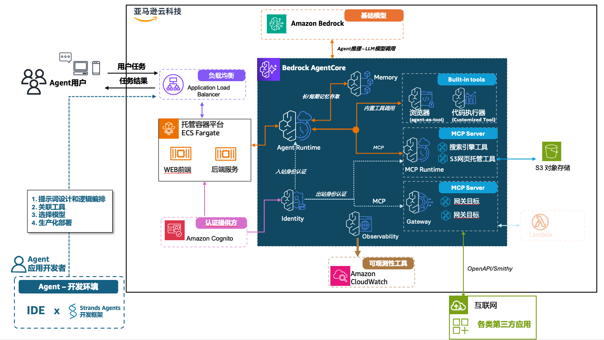
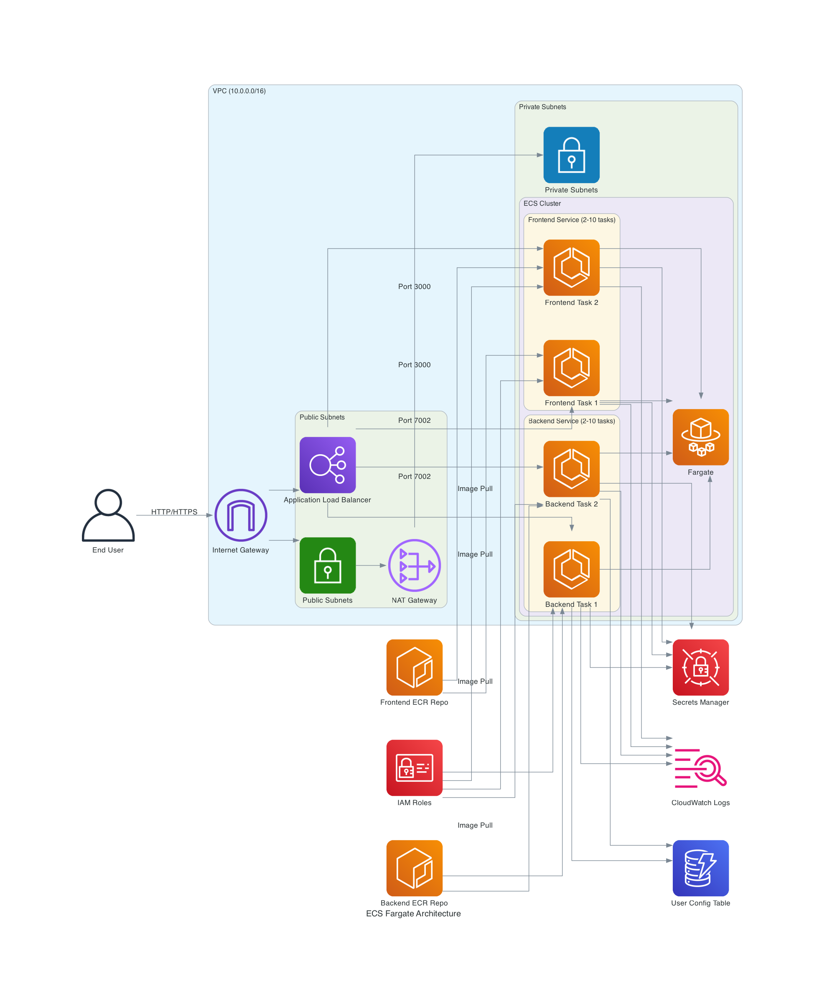
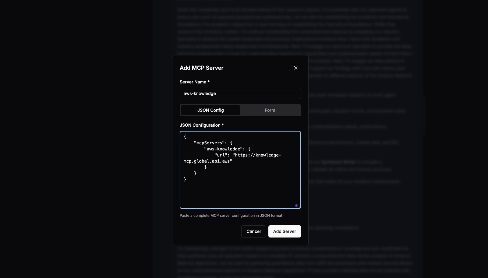
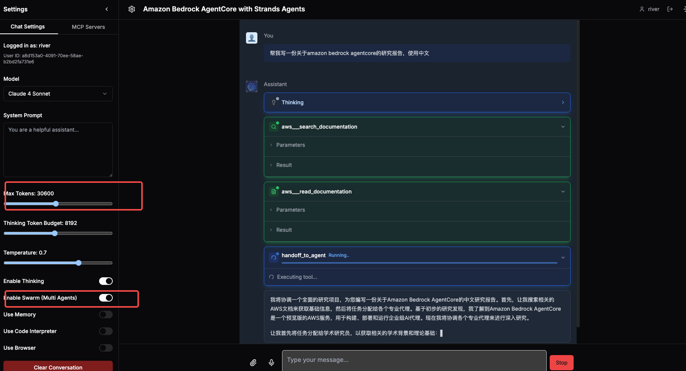

# Agentic AI with Bedrock AgentCore and Strands Agents SDK [中文](./README.md)

## 1. Overview

This comprehensive Agentic AI application built with Strands Agents SDK demonstrates how to integrate AgentCore Memory, Identity, Code Interpreter, Browser, and MCP/Gateway on the AgentCore Runtime. It implements a versatile personal assistant in both standalone Agent and Swarm modes. Bedrock AgentCore serves as the core engine, providing powerful Agent capabilities and tool integration mechanisms that make the entire system highly extensible and practical.

### 1.1. System Architecture


The application consists of a web frontend and backend services, both containerized and deployed to Amazon ECS Fargate with external access provided through an Application Load Balancer (ALB). The backend services support web client operations such as user session creation, model selection, MCP tool selection, and system prompt configuration. These services receive requests from the web client and forward tasks to the Agent Runtime, where Agents determine whether to invoke browsers, code interpreters, MCP tools running on MCP Runtime, or additional MCP tools exposed through Gateway based on user requirements.

### 1.2 Key Features
- **Decoupled Frontend and Backend** - Both MCP Client and Server can be deployed server-side, allowing users to interact directly through web browsers to access LLM and MCP Server capabilities and resources
- **AgentCore Core Capabilities** - Integration with Runtime, Gateway, Memory, Browser, Code Interpreter, Identity, and Observation
- **Authentication** - AWS Cognito User Pool service for unified user registration, authentication, authorization, and secure access to MCP runtime and Gateway
- **React UI** - React-based user interface for model interaction, MCP server management, and display of tool invocation results and reasoning processes
- **Multiple Model Providers** - Support for Bedrock, OpenAI, and compatible models
- **Multi-user Session Management** - Maintenance of multiple user sessions
- **Strands Agents SDK** - Support for single-agent and Swarm multi-agent deep research modes

### 1.3 Core Module Descriptions

#### Agent Runtime
1. Runs Strands Agents, using default IAM for inbound authentication through backend services
2. Uses AgentCore memory for both short and long-term memory storage
3. Includes two Python tools for direct access to AgentCore's browser and code interpreter
4. Supports custom MCP server installation within the runtime
5. Can connect to MCP runtime or Gateway

#### MCP Runtime
1. Customizable implementation or adaptation of local code into MCP runtime
2. OAuth-based inbound authentication using Cognito UserPool
3. Outbound authentication via OAuth or API Key Credential Provider (e.g., OAuth for Google Calendar, API Key for EXA search)

#### Gateway
1. Implementation of Lambda functions as gateway targets
2. OpenAPI/Smithy description documents for API-based gateway targets
3. OAuth-based inbound authentication using Cognito UserPool
4. IAM-based outbound authentication for Lambda targets
5. API Key Credential Provider for API-based targets

### Memory
1. Strands Agent SDK hook functions to monitor AfterInvocationEvent for storing conversation messages as short-term memories
2. Strands Agent SDK hook functions to monitor AgentInitializedEvent for restoring short-term memories when creating Agents
3. Long-term memory retrieval implemented as an Agent tool, allowing Agents to autonomously decide when to access long-term memories

### Browser
1. Browser runtime CDP protocol passed to browser agent as a tool

### Identity
Unified identity provider through Cognito UserPool using the same pool and client ID for:
1. Web frontend user authentication
2. Gateway and MCP runtime OAuth authentication

## 2. Installation 
### Method 1: Installing Pre-configured Environment Using CloudFormation
Utilize the provided [CloudFormation template](./cfn.yml) to provision an EC2 instance that will automatically download the codebase and install the requisite dependencies.   
Upon accessing the EC2 instance, navigate to `sample_agentic_ai_strands/agentcore_scripts/` to commence subsequent installation procedures, as detailed in step 2.4.

### Method 2: Comprehensive Manual Installation Approach
### 2.1. Dependencies

Most MCP Servers are developed using NodeJS or Python and run on users' PCs, requiring these dependencies.

### 2.1 NodeJS

Download and install NodeJS from [nodejs.org](https://nodejs.org/en/download). This project has been thoroughly tested with version `v22.18.0`.

### 2.2 Python

Some MCP Servers are Python-based, requiring [Python installation](https://www.python.org/downloads/). This project's code is also Python-based.

First, install the Python package management tool `uv` by following the [official guide](https://docs.astral.sh/uv/getting-started/installation/):

```bash
curl -LsSf https://astral.sh/uv/install.sh | sh
```

### 2.3 Docker
- Install Docker and Docker Compose: https://docs.docker.com/get-docker/
- Linux Docker installation commands:
```bash
# Install Docker
curl -fsSL https://get.docker.com -o get-docker.sh
sudo sh get-docker.sh
sudo systemctl enable docker && sudo systemctl start docker && sudo usermod -aG docker ubuntu
sudo chmod 666 /var/run/docker.sock

# Install Docker Compose
sudo curl -L "https://github.com/docker/compose/releases/download/v2.24.6/docker-compose-$(uname -s)-$(uname -m)" -o /usr/local/bin/docker-compose
sudo chmod +x /usr/local/bin/docker-compose
ln -s /usr/bin/docker-compose  /usr/local/bin/docker-compose
```

### 2.4 Creating Cognito Resources
After cloning the project, navigate to the `agentcore_scripts/` directory and run the setup script to create IAM roles, Cognito UserPool, and AgentCore memory:
```bash
cd agentcore_scripts/
bash run_setup.sh
```

After completion, the script will generate `.env_setup` in the `agentcore_scripts/` directory, and `.env` and `.bedrock_agentcore.yaml` in the project root directory.

The `.env_setup` file contains the ECR and Cognito configurations needed for AgentCore runtime:

Example:
```
ECR_REPOSITORY_URI=xxx.dkr.ecr.us-west-2.amazonaws.com/bedrock_agentcore-agent_runtime
AGENTCORE_EXECUTION_ROLE=arn:aws:iam::xxx:role/agentcore-strands_agent_role-role
COGNITO_USER_POOL_ID=us-west-xxx
COGNITO_CLIENT_ID=xxx
COGNITO_M2M_CLIENT_ID=xxx
COGNITO_M2M_CLIENT_SECRET=xxx
COGNITO_M2M_CLIENT_SCOPE="strands-demo-resource-server-id/gateway:read strands-demo-resource-server-id/gateway:write"
discovery_url=https://cognito-idp.us-west-2.amazonaws.com/us-west-xxx/.well-known/openid-configuration
MEMORY_ID=AgentMemory-xxxx
```

### 2.5 Creating AgentCore Runtime Configuration
1. Navigate to the project directory and create a Python virtual environment with dependencies:
```bash
cd ./sample_agentic_ai_strands
uv sync
```

### 2.6 Deploying AgentCore Runtime
Launch the AgentCore runtime using the CLI (requires ARM environment):
```bash
uv run agentcore launch
```

### 2.7 Set AgentCore ARN in .env
After successful deployment, note the `Agent ARN` from the console output and edit the `.env` file to add the ARN to the following environment variable:

Example:
```bash
AGENTCORE_RUNTIME_ARN=arn:aws:bedrock-agentcore:us-west-2:xxxx:runtime/xxxxx
```

## 3. Deploying Frontend and Backend to ECS
(Production mode, AWS ECS deployment)
```bash
cd cdk/
# Install CDK CLI
npm install -g aws-cdk
npm install -g typescript
npm install
npm i --save-dev @types/node
```

run CDK bootstrap if you never used cdk in this account  
```bash
npx cdk bootstrap
```

run CDK deploy  
```bash
./cdk-build-and-deploy.sh
```

Following the deployment completion, an Application Load Balancer (ALB) address becomes visible within the script, which can be accessed via web browser to launch the application interface.

The default credentials consist of username `testuser` and password `MyPassword123!`. Alternatively, users may register new accounts utilizing their email addresses as prompted by the interface.



This demo follows AWS best practices by deploying applications in private subnets with public access through load balancers and serverless container management via Fargate. The architecture includes:

1. ECS Cluster:
   - Serverless container environment running on Fargate using ARM architecture
   - Frontend service: Minimum 2 tasks, auto-scaling based on CPU usage
   - Backend service: Minimum 2 tasks, auto-scaling based on CPU usage

2. VPC:
   - Public and private subnets across two availability zones
   - Internet Gateway and NAT Gateway in public subnets
   - Private subnets for ECS tasks

3. Application Load Balancer:
   - Routes `/v1/*` and `/api/*` paths to backend services
   - Routes other requests to frontend services

4. Data Storage:
   - DynamoDB tables for user configuration storage

5. Security Components:
   - IAM roles and policies for access control
   - Secrets Manager for backend service API key configuration
   - Security groups for network traffic control

6. Container Images:
   - Frontend and backend container images stored in ECR

## 4. Running AgentCore Locally

- Create a DynamoDB table named `agent_user_config_table`:
```bash
aws dynamodb create-table \
    --table-name agent_user_config_table \
    --attribute-definitions AttributeName=userId,AttributeType=S \
    --key-schema AttributeName=userId,KeyType=HASH \
    --billing-mode PAY_PER_REQUEST 
```

- Launch AgentCore locally with an 8080 service using:
```bash
uv run src/agentcore_runtime.py
```

Test with Postman or similar tools:
Request URL: `http://127.0.0.1:8080/invocations`
Payload example:
```json
{
        "user_id":"a8d153a0-4091-70ee-58ae-b2bd2fa731e6",
        "request_type":"chatcompletion",
        "data" :{
                "model": "us.anthropic.claude-3-7-sonnet-20250219-v1:0",
                "mcp_server_ids": [],
                "extra_params":{"use_mem":false,"use_swarm":false,"use_code_interpreter":false,"use_browser":false},
                "messages": [
                    {
                        "role": "user",
                        "content": [
                            {
                                "type": "text",
                                "text": "The impact of AI on software development"
                            }
                        ]
                    }
                ]
            }
    }
```

## 5. Example
### Using Swarm Mode for Deep Research
- Install AWS Knowledge MCP server:


```json
{
    "mcpServers": {
        "aws-knowledge": {
            "url": "https://knowledge-mcp.global.api.aws"
        }
    }
}
```
- Select `Claude 4 Sonnet` or `Claude 3.7 Sonnet` model, adjust `Max Tokens: 30600`

- Enable Swarm mode to deploy a multi-agent team for deep research:
```python
{
    "research_coordinator": research_coordinator,
    "academic_researcher": academic_researcher,
    "industry_analyst": industry_analyst,
    "technical_specialist": technical_specialist,
    "data_analyst": data_analyst,
    "synthesis_writer": synthesis_writer,
    "fact_checker": fact_checker
}
```

- Input: `Help me write a research report about Amazon Bedrock AgentCore in Chinese`


## 6. More Examples
- [Case Studies](./README_cases_en.md)