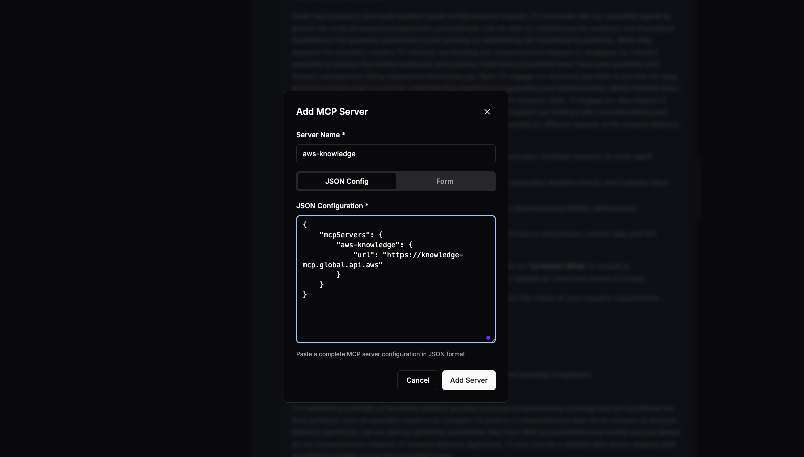
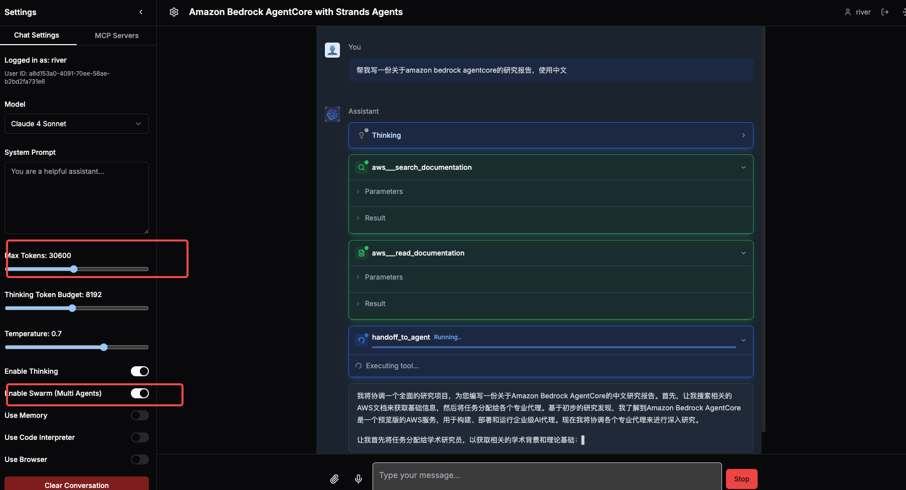

# Agentic AI with Bedrock AgentCore and Strands Agents SDK [English](./README.en.md)


## 1.概述

基于Strands Agents SDK开发的通用型Agentic AI应用，展示了在AgentCore Runtime上，如何与AgentCore Memory,Identity,Code Interpreter，Browser，MCP/Gateway的集成，实现了单体Agent，Swarm模式的个人通用助手。Bedrock AgentCore作为核心引擎,提供了强大的Agent能力和工具集成机制，使得整个系统具备了高度的可扩展性和实用性。

### 1.1.系统架构图
 
  
应用总体分为前端web和后端服务两部分，其中前端web和后端服务均以容器化方式部署到Amazon ECS Fargate中, 通过ALB负载均衡提供对外访问链接。
后端服务提供WEB端的后台服务，如用户session创建，模型选择设置，MCP工具选择，系统提示词设定等，后端服务接收来自WEB端的请求，并把任务发送给Agent Runtime，再由Runtime中的Agent根据用户任务自行决定是否调用浏览器、代码执行器，运行在MCP Runtime上的MCP工具，或者通过Gateway暴露的更多MCP工具。

### 1.2 功能特点
- **前后端分离** - MCP Client和MCP Server均可以部署到服务器端，用户可以直接使用web浏览器通过后端web服务交互，从而访问LLM和MCP Sever能力和资源
- **使用AgentCore核心能力** -集成了Runtime，Gateway，Memory，Browser，Code Interpreter, Indentity, Observeration
- **身份认证** - 使用AWS Cognito User Pool服务，提供统一的用户注册，鉴权，授权，以及后端MCP runtime，Gateway授权和健全。
- **React UI** - 基于React的用户界面，允许用户与模型交互并管理MCP服务器，显示工具调用结果和思考过程
- **多模型提供商** - 支持 Bedrock、OpenAI及兼容模型
- **多用户会话管理** - 维护多用户session
- **使用Strands Agents SDK** - 提供单体Agent， Swarm Multi-Agents深度研究模式

### 1.3 各核心模块说明

#### Agent Runtime
1. 运行Strands Agents，由于是通过后端服务来调用runtime，所以这里可以直接采用默认的iam方式做入站认证
2. 使用Agentcore memory保存长短期记忆
3. 包含2个python tool，用于直接使用agentcore 的 browser和code interpreter
4. 可以自行在runtime中安装MCP server
5. 可以连接MCP runtime或者Gateway 

#### MCP Runtime
1. 自行实现或者选择一些本地代码的MCP server改造成MCP runtime
2. OAuth方式做入站身份认证，使用cognito userpool 做认证提供方。
3. 出站认证可以使用OAuth或者API Key Credential Provider两种方式，例如：使用google日历则需要用OAuth，如果是EXA search则直接用API Key Credential Provider。

#### Gateway 
1. 实现lambda函数作为gateway target接入，该lambda函数实现场景：tbd
2. 实现用OpenApi/Smithy描述文档转成一个gateway target接入，该api实现的场景：tbd
3. OAuth方式做入站身份认证，使用cognito userpool 做认证提供方
4. 如果目标是lambda，则直接用iam做出站认证
5. 如果目标是api，则用API Key Credential Provider做出站认证

### Memory
1. 使用Strands Agent SDK hook函数，监听AfterInvocationEvent，把每轮对话消息保存成短期记忆。
2. 使用Strands Agent SDK hook函数，监听AgentInitializedEvent，每次创建Agent时，回复短期记忆
3. 长期记忆检索模块做成Agent tool，让Agent自主决定是否检索长期记忆

### Browser 
1. 将Browser runtime的CDP协议传给browser use agent，以agent as tool形式使用Browser

### Identity
使用cognito userpool做为统一的identity provider，使用同一个userpool和client id提供：
1. WEB前端用户登陆鉴权
2. Gateway和MCP runtime OAuth鉴权


## 2.安装方法
### 方法1:使用cloudformation安装预置环境
使用该[cloudformation模板](./cfn.yml)创建一台ec2，这台ec2中会自动下载代码，安装好依赖环境。 登陆ec2后，进入`sample_agentic_ai_strands/agentcore_scripts/`开始后续安装，具体参考步骤2.4


### 方法2:完全手动安装方法
### 2.1. 手动依赖安装
目前主流 MCP Server 基于 NodeJS 或者 Python 开发实现并运行于用户 PC 上，因此用户 PC 需要安装这些依赖。

### 2.1 NodeJS

NodeJS [下载安装](https://nodejs.org/en/download)，本项目已对 `v22.18.0` 版本充分测试。

### 2.2 Python

有些 MCP Server 基于 Python 开发，因此用户必须安装 [Python](https://www.python.org/downloads/)。此外本项目代码也基于 Python 开发，需要安装环境和依赖。

首先，安装 Python 包管理工具 uv，具体可参考 [uv](https://docs.astral.sh/uv/getting-started/installation/) 官方指南

```bash
curl -LsSf https://astral.sh/uv/install.sh | sh
```

### 2.3 Docker(如有可跳过)
- 安装Docker和Docker Compose：https://docs.docker.com/get-docker/
- Linux下安装Docker命令：
```bash
# 安装Docker
curl -fsSL https://get.docker.com -o get-docker.sh
sudo sh get-docker.sh
sudo systemctl enable docker && sudo systemctl start docker && sudo usermod -aG docker ubuntu
sudo chmod 666 /var/run/docker.sock

# 安装Docker Compose
sudo curl -L "https://github.com/docker/compose/releases/download/v2.24.6/docker-compose-$(uname -s)-$(uname -m)" -o /usr/local/bin/docker-compose
sudo chmod +x /usr/local/bin/docker-compose
ln -s /usr/bin/docker-compose  /usr/local/bin/docker-compose
```

### 2.4 创建cognito
下载克隆该项目后, 进入`agentcore_scripts/`目录下，运行脚本，创建iam role, cognito userpool, agentcore memory.  
```bash
cd sample_agentic_ai_strands/agentcore_scripts/
bash run_setup.sh
```
运行完成后会在`agentcore_scripts/`目录下生成`.env_setup`，项目根目录下生成`.env`和`.bedrock_agentcore.yaml`, 三个文件。
其中`.env_setup`中有配置AgentCore runtime所需要的ECR，Cognito配置:    
示例：  
```
ECR_REPOSITORY_URI=xxx.dkr.ecr.us-west-2.amazonaws.com/bedrock_agentcore-agent_runtime
AGENTCORE_EXECUTION_ROLE=arn:aws:iam::xxx:role/agentcore-strands_agent_role-role
COGNITO_USER_POOL_ID=us-west-xxx
COGNITO_CLIENT_ID=xxx
COGNITO_M2M_CLIENT_ID=xxx
COGNITO_M2M_CLIENT_SECRET=xxx
COGNITO_M2M_CLIENT_SCOPE="strands-demo-resource-server-id/gateway:read strands-demo-resource-server-id/gateway:write"
discovery_url=https://cognito-idp.us-west-2.amazonaws.com/us-west-xxx/.well-known/openid-configuration
MEMORY_ID=AgentMemory-xxxx
```


### 2.5 创建AgentCore Runtime配置
1. 进入项目目录创建 Python 虚拟环境并安装依赖：  
```bash
cd ./sample_agentic_ai_strands
uv sync
```

### 2.6 部署AgentCore Runtime
运行agentcore cli部署runtime
```bash
uv run agentcore launch
```
部署完成后，在控制台会看到 `Agent ARN`，请使用vim 打开`.env`文件编辑，把arn配置到以下环境变量中。
例如：  
```bash
AGENTCORE_RUNTIME_ARN=arn:aws:bedrock-agentcore:us-west-2:xxxx:runtime/xxxxx
```

## 3. 部署前端和Web后端到ECS
（生产模式，AWS ECS部署）
```bash
cd cdk/
# Install CDK CLI
npm install -g aws-cdk
npm install -g typescript
npm install
npm i --save-dev @types/node
```

如果之前没有CDK bootstrap  
```bash
npx cdk bootstrap
```

运行部署脚本  
```bash
./cdk-build-and-deploy.sh
```


 这个Demo的部署架构遵循AWS最佳实践，将应用程序部署在私有子网中，通过负载均衡器提供公共访问，并使用Fargate实现无服务器容器管理。 这个部署架构包含以下主要亚马逊云组件：
1. ECS Cluster：
 • 运行在Fargate上的无服务器容器环境, 使用ARM架构
 • 前端服务：最小2个任务，根据CPU使用率自动扩展
 • 后端服务：最小2个任务，根据CPU使用率自动扩展

2.  VPC ：
 • 包含公有子网和私有子网，跨越2个可用区
 • 公有子网中有Internet Gateway和NAT Gateway
 • 私有子网用于运行ECS任务

3. 应用负载均衡：
 • 应用负载均衡器(ALB)分发流量
 • 将/v1/*和/api/*路径的请求路由到后端服务
 • 将其他请求路由到前端服务

4. 数据存储：
 • DynamoDB表用于存储用户配置

5. 安全组件：
 • IAM角色和策略控制访问权限
 • Secrets Manager生成并存储后端服务API KEY配置信息
 • 安全组控制网络流量

6. 容器镜像：
 • 前端和后端容器镜像存储在ECR中


## 4. 本地运行agentcore
- 创建一个dynamodb table, 名称为agent_user_config_table
```bash
aws dynamodb create-table \
    --table-name agent_user_config_table \
    --attribute-definitions AttributeName=userId,AttributeType=S \
    --key-schema AttributeName=userId,KeyType=HASH \
    --billing-mode PAY_PER_REQUEST 
```

- 可以通过以下命令在本地运行agentcore，并启动一个本地8080服务。 
```bash
uv run src/agentcore_runtime.py
```

- 可以使用postman等工具发起post调用:
request url:  
`http://127.0.0.1:8080/invocations`
payload如下： 
```json
{
        "user_id":"a8d153a0-4091-70ee-58ae-b2bd2fa731e6",
        "request_type":"chatcompletion",
        "data" :{
                "model": "us.anthropic.claude-3-7-sonnet-20250219-v1:0",
                "mcp_server_ids": [],
                "extra_params":{"use_mem":false,"use_swarm":false,"use_code_interpreter":false,"use_browser":false},
                "messages": [
                    {
                        "role": "user",
                        "content": [
                            {
                                "type": "text",
                                "text": "The impact of AI on software development"
                            }
                        ]
                    }
                ]
            }
    }
```
## 5. 示例
### 开启Swarm做deepresearch
- 安装AWS Knowledge MCP server

  
```json
{
    "mcpServers": {
        "aws-knowledge": {
            "url": "https://knowledge-mcp.global.api.aws"
        }
    }
}
```
- 选择模型`Claude 4 Sonnet` or `Claude 3.7 Sonnet`, 调整`Max Tokens: 30600`

- 开启Swarm开关,这种模式下，会启动一个Multi Agents小组进行deep research：
```python
{
    "research_coordinator": research_coordinator,
    "academic_researcher": academic_researcher,
    "industry_analyst": industry_analyst,
    "technical_specialist": technical_specialist,
    "data_analyst": data_analyst,
    "synthesis_writer": synthesis_writer,
    "fact_checker": fact_checker
}
```

- 输入 `帮我写一份关于amazon bedrock agentcore的研究报告，使用中文`


## 6.更多示例
- [case](./README_cases.md)