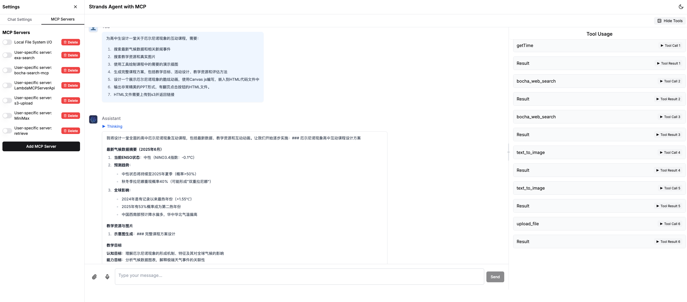
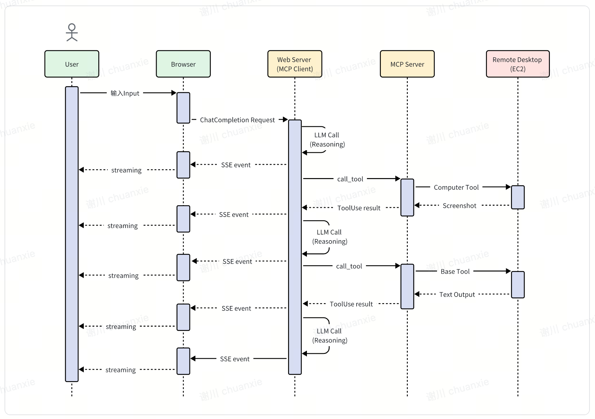

## Usage Guide

### React Web UI 
- 🚀 Modern frontend built with Next.js 15 and React 18, supporting Dark/Light mode
- 🎨 Beautiful user interface using Tailwind CSS and Shadcn UI component library
- 🔄 Real-time streaming responses for smooth conversation experience
- 🧠 Support for "thinking" mode, displaying model reasoning process
- 🛠️ MCP server management functionality with server addition and configuration
- 👤 User session management maintaining conversation context
- 📊 Visualization of tool usage results, including image display


### Adding MCP Server
Currently, MCP Servers can be added in two ways:
1. Pre-configured in `conf/config.json` - loaded each time the Chat interface service restarts
2. Through the ChatBot UI - submit MCP Server parameters via form (effective only for current session, lost after service restart)

Below demonstrates how to add an MCP Server through the ChatBot UI, using Web Search provider [Exa](https://exa.ai/) as an example. The open-source community has already created an [MCP Server](https://github.com/exa-labs/exa-mcp-server) for it.

First, visit [Exa](https://exa.ai/) official website to register an account and obtain an API Key.

Then click "Add MCP Server" and fill in the following parameters in the popup menu:

- Method 1: Directly add MCP JSON configuration file (same format as Anthropic official)
```json
{
  "mcpServers": {
    "exa": {
      "command": "npx",
      "args": ["-y","exa-mcp-server"],
      "env": {
        "EXA_API_KEY": "your-api-key-here"
      }
    }
  }
}
```
- Method 2: Add by fields

The newly added item will now appear in the existing MCP Server list. Check it to start the MCP Server.

## Usage Examples
### 1. Using MCP Computer Use to Operate EC2 Remote Desktop
- In production mode, the code is pre-downloaded in the cluster

- In development mode, you need to install and download remote-computer-use:
```bash
git clone https://github.com/aws-samples/aws-mcp-servers-samples.git
```
Note: Change the --directory path in the configuration below to your local path

- You need to set up an EC2 instance in advance and configure VNC remote desktop. For installation steps, please refer to the [documentation](https://github.com/aws-samples/aws-mcp-servers-samples/blob/main/remote_computer_use/README.md)
- After environment setup, configure the following in the MCP demo client:
```json
{
    "mcpServers": {
        "computer_use": {
            "command": "uv",
            "env": {
                "VNC_HOST":"",
                "VNC_PORT":"5901",
                "VNC_USERNAME":"ubuntu",
                "VNC_PASSWORD":"",
                "PEM_FILE":"",
                "SSH_PORT":"22",
                "DISPLAY_NUM":"1"
            },
            "args": [
                "--directory",
                "/app/aws-mcp-servers-samples/remote_computer_use",
                "run",
                "server_claude.py"
            ]
        }
    }
}
```
- For Computer Use, Claude 3.7 model is recommended with the following system prompt:

```plaintext
You are an expert research assistant with deep analytical skills.
you have capability:
<SYSTEM_CAPABILITY>
* You are utilising an Ubuntu virtual machine using Linux architecture with internet access.
* You can feel free to install Ubuntu applications with your bash tool. Use curl instead of wget.
* When viewing a page it can be helpful to zoom out so that you can see everything on the page.  Either that, or make sure you scroll down to see everything before deciding something isn't available.
* When using your computer function calls, they take a while to run and send back to you.  Where possible/feasible, try to chain multiple of these calls all into one function calls request.
* You can double click to open firefox
</SYSTEM_CAPABILITY>
<IMPORTANT>
  * Don't assume an application's coordinates are on the screen unless you saw the screenshot. To open an application, please take screenshot first and then find out the coordinates of the application icon. 
  * When using Firefox, if a startup wizard or Firefox Privacy Notice appears, IGNORE IT.  Do not even click "skip this step".  Instead, click on the address bar where it says "Search or enter address", and enter the appropriate search term or URL there. Maximize the Firefox browser window to get wider vision.
  * If the item you are looking at is a pdf, if after taking a single screenshot of the pdf it seems that you want to read the entire document instead of trying to continue to read the pdf from your screenshots + navigation, determine the URL, use curl to download the pdf, install and use pdftotext to convert it to a text file, and then read that text file directly with your StrReplaceEditTool.
  * After each step, take a screenshot and carefully evaluate if you have achieved the right outcome. Explicitly show your thinking: "I have evaluated step X..." If not correct, try again. Only when you confirm a step was executed correctly should you move on to the next one.
</IMPORTANT>
```

- **Sequence Diagram: Using Computer Use to Operate EC2 Remote Desktop**


## Awesome MCPs
- AWS MCP Servers Samples https://github.com/aws-samples/aws-mcp-servers-samples
- AWS Labs MCP Servers https://awslabs.github.io/mcp
- https://github.com/punkpeye/awesome-mcp-servers
- https://github.com/modelcontextprotocol/servers
- https://www.aimcp.info/en
- https://github.com/cline/mcp-marketplace
- https://github.com/xiehust/sample-mcp-servers
- https://mcp.composio.dev/
- https://smithery.ai/
- https://mcp.so/

**[LICENSE](./LICENSE)**