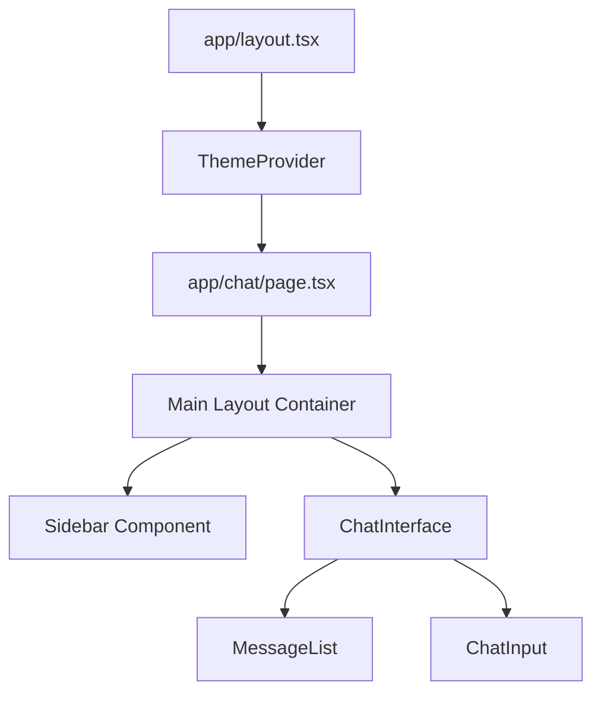
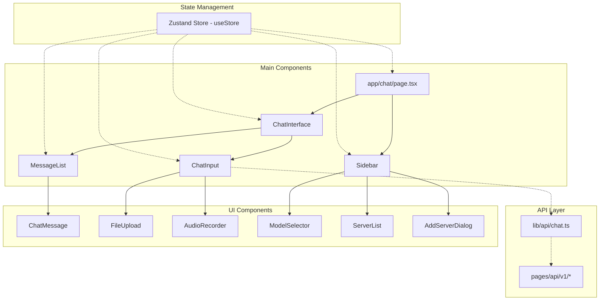
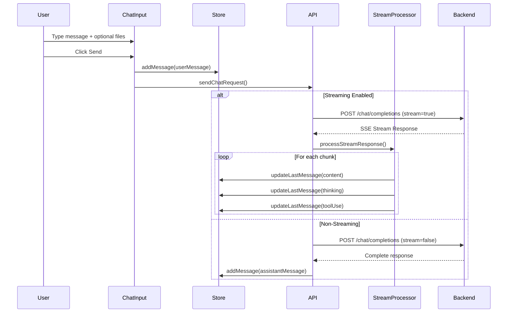
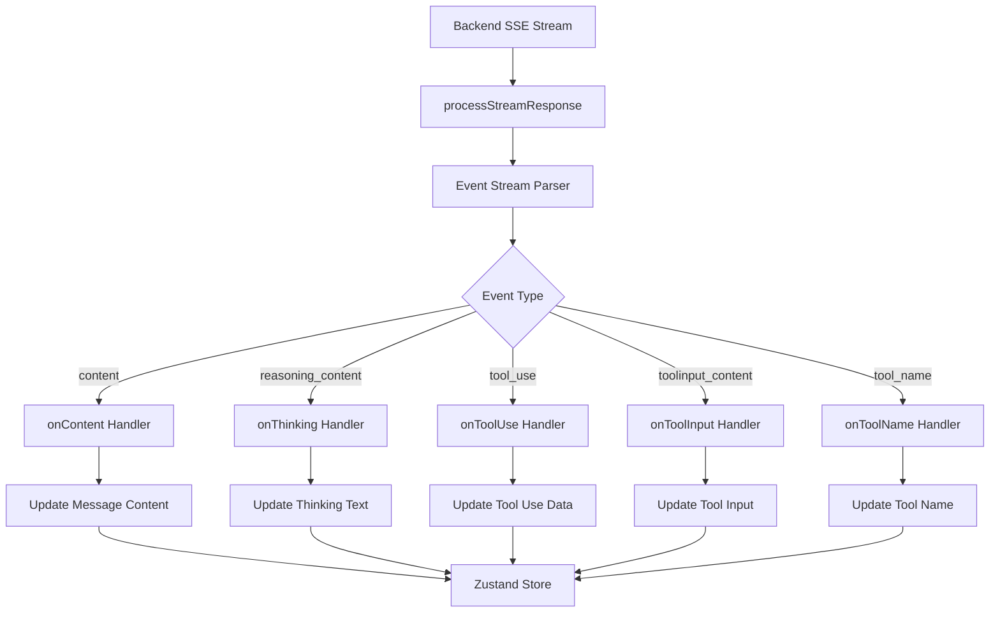
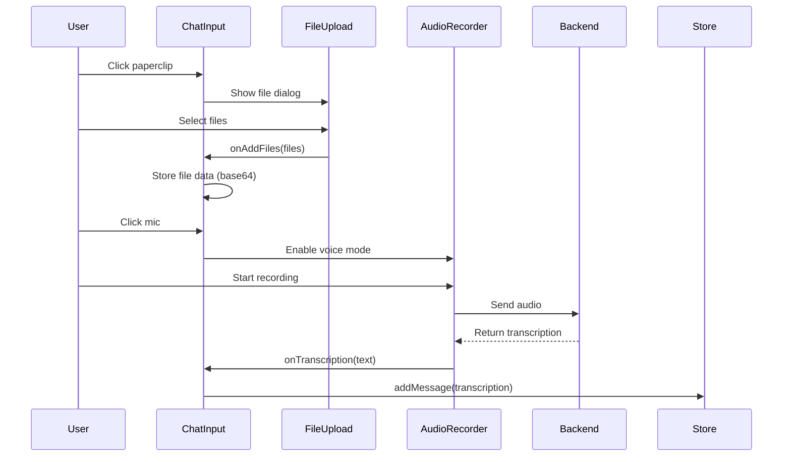
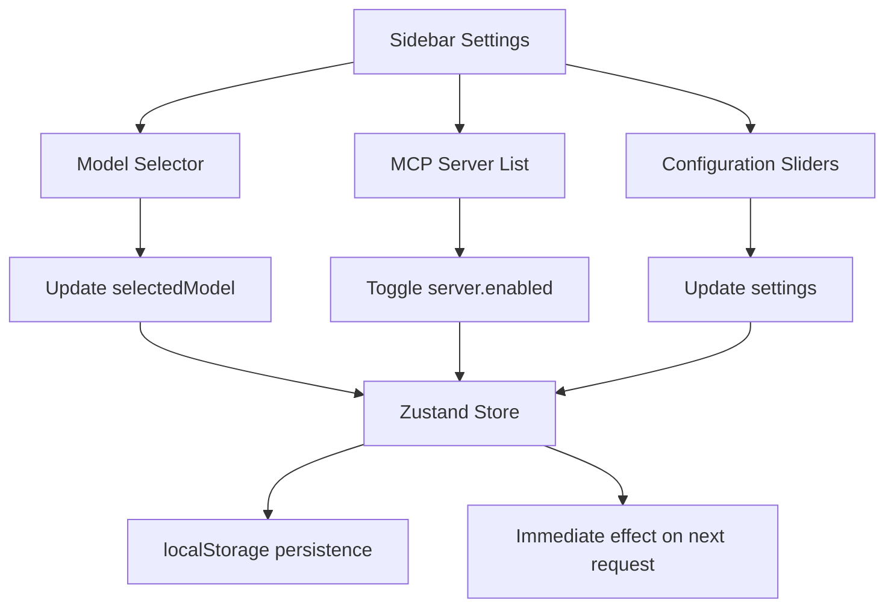
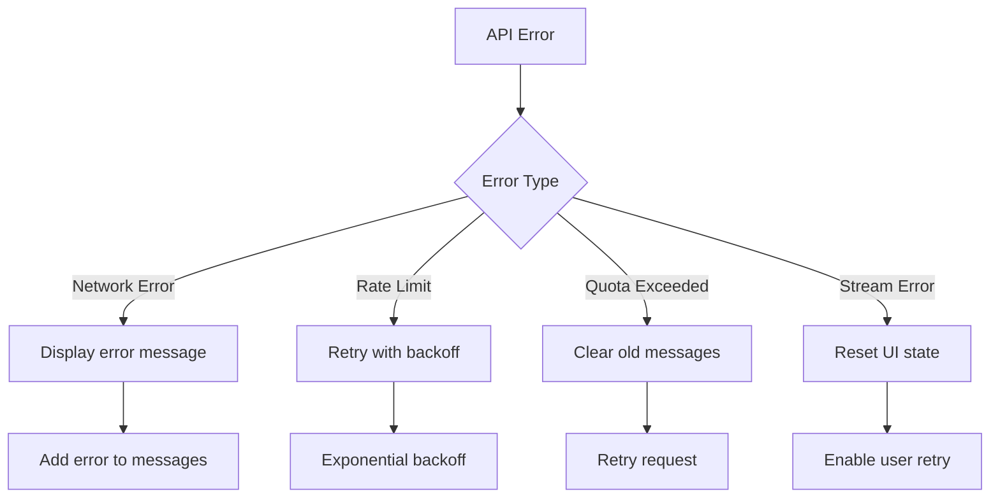

# React Frontend Code Flow Analysis

## Overview
This document provides a comprehensive analysis of the React frontend code structure and flow in the `react_ui` directory. The application is built with Next.js 14 App Router, TypeScript, and uses Zustand for state management.

## Table of Contents
1. [Architecture Overview](#architecture-overview)
2. [Component Hierarchy](#component-hierarchy)
3. [State Management](#state-management)
4. [API Layer](#api-layer)
5. [Message Flow](#message-flow)
6. [Streaming Architecture](#streaming-architecture)
7. [File Upload & Voice Processing](#file-upload--voice-processing)
8. [Settings & Configuration](#settings--configuration)
9. [Error Handling](#error-handling)
10. [Performance Optimizations](#performance-optimizations)

## Architecture Overview

### Technology Stack
- **Framework**: Next.js 14 App Router
- **Language**: TypeScript
- **State Management**: Zustand with persistence
- **Styling**: Tailwind CSS
- **UI Components**: Custom components with Radix UI primitives
- **API**: RESTful with Server-Sent Events (SSE)

### Application Structure
```
react_ui/
├── app/
│   ├── layout.tsx          # Root layout with theme provider
│   └── chat/
│       ├── layout.tsx      # Chat layout
│       └── page.tsx        # Main chat page
├── components/
│   ├── chat/              # Chat-specific components
│   ├── sidebar/           # Settings and server management
│   └── ui/                # Reusable UI components
├── lib/
│   ├── api/               # API client code
│   └── store.ts           # Zustand state management
└── pages/api/v1/          # Next.js API routes
```

## Component Hierarchy

### Main Components Flow


### Component Relationships


## State Management

### Zustand Store Structure
```typescript
interface ChatStore {
  // Messages
  messages: Message[]
  addMessage: (message: Message) => void
  updateLastMessage: (...) => void
  clearMessages: () => void
  
  // Settings
  systemPrompt: string
  maxTokens: number
  temperature: number
  enableThinking: boolean
  enableStream: boolean
  
  // Models & Servers
  models: Model[]
  selectedModel: string
  mcpServers: McpServer[]
  
  // User
  userId: string
}
```

### State Persistence
- **Storage**: localStorage with `mcp-chat-store` key
- **Optimization**: Base64 data removal for large files/images
- **Message Limit**: Last 20 messages stored to prevent quota issues
- **Cleanup**: Automatic removal of large binary data

## API Layer

### API Endpoints
```mermaid
graph TD
    subgraph "Frontend API Layer"
        A[lib/api/chat.ts]
    end
    
    subgraph "Backend Endpoints"
        B[/list/models]
        C[/list/mcp_server]
        D[/chat/completions]
        E[/add/mcp_server]
        F[/remove/mcp_server/:id]
        G[/stop/stream/:id]
    end
    
    subgraph "Next.js API Routes"
        H[pages/api/v1/list/models.ts]
        I[pages/api/v1/list/mcp_server.ts]
        J[pages/api/v1/chat/completions.ts]
        K[pages/api/v1/add/mcp_server.ts]
        L[pages/api/v1/remove/mcp_server/[id].ts]
        M[pages/api/v1/stop/stream/[id].ts]
    end
    
    A --> B
    A --> C
    A --> D
    A --> E
    A --> F
    A --> G
    
    B --> H
    C --> I
    D --> J
    E --> K
    F --> L
    G --> M
```

### API Client Configuration
- **Base URL**: Environment-aware (production vs development)
- **Authentication**: Bearer token with user ID headers
- **SSL Handling**: Disabled for self-signed certificates in development
- **Timeout Handling**: 5-second timeout for stop requests

## Message Flow

### Complete Message Processing Flow


### Message Structure
```typescript
interface Message {
  role: 'system' | 'user' | 'assistant'
  content: string | ContentItem[]
  thinking?: string
  isThinking?: boolean
  toolUse?: any[]
  toolName?: any[]
  toolInput?: any[]
  toolCalls?: ToolCall[]
}

type ContentItem = {
  type: 'text' | 'image_url' | 'file'
  text?: string
  image_url?: { url: string, detail?: string }
  file?: { file_data: string, filename: string }
}
```

## Streaming Architecture

### Server-Sent Events Processing


### Stream Processing Features
- **Real-time Updates**: Content, thinking, and tool usage
- **Error Recovery**: Automatic retry and graceful degradation
- **Abort Handling**: User can stop generation mid-stream
- **Buffer Management**: Handles partial JSON across chunks

## File Upload & Voice Processing

### Multi-Modal Input Flow


### Supported File Types
- **Images**: PNG, JPG, JPEG, GIF, WebP (converted to base64)
- **Documents**: PDF, TXT, JSON, CSV (as file attachments)
- **Audio**: Voice recording via Web Audio API

## Settings & Configuration

### Dynamic Configuration Updates


### Configuration Options
- **Model Selection**: Dynamic model list from backend
- **System Prompt**: Customizable assistant behavior
- **Token Limits**: Max tokens (100-64000) and budget tokens (1024-16384)
- **Temperature**: 0.0-1.0 scale for response randomness
- **Features**: Thinking, memory, swarm mode toggles
- **Image Handling**: N most recent images (0-5)

## Error Handling

### Error Flow


### Error Recovery Strategies
- **Network Errors**: Automatic retry with exponential backoff
- **Quota Exceeded**: Clear old messages and retry
- **Stream Errors**: Reset UI state and allow user retry
- **Validation Errors**: Clear user feedback with actionable steps

## Performance Optimizations

### Memory Management
- **Message Truncation**: Only last 20 messages stored in localStorage
- **Base64 Cleanup**: Large file data removed from storage
- **Streaming Buffer**: Efficient SSE chunk processing
- **Debounced Updates**: Scroll handling with 500ms debounce

### Caching Strategy
- **MCP Servers**: Cached after initial load
- **Models**: Cached per session
- **User Settings**: Persisted in localStorage
- **Message History**: Server-side storage with userId

### Optimization Techniques
- **Lazy Loading**: Components loaded on demand
- **Memoization**: Prevent unnecessary re-renders
- **Debounced Input**: Settings sliders with debounce
- **Virtual Scrolling**: Efficient message list rendering
- **Image Optimization**: Base64 data cleanup for storage

## Development & Deployment

### Environment Configuration
```bash
# Development
NEXT_PUBLIC_MCP_BASE_URL=http://localhost:7002
NEXT_PUBLIC_API_KEY=your-api-key

# Production
NEXT_PUBLIC_MCP_BASE_URL=/v1
NODE_ENV=production
```

### Build Process
1. **Type Checking**: TypeScript compilation
2. **Optimization**: Next.js build optimization
3. **Static Assets**: Image and font optimization
4. **Bundle Analysis**: Size monitoring and optimization

## Key Takeaways

1. **Scalable Architecture**: Modular component design with clear separation of concerns
2. **Real-time Features**: Full streaming support with SSE and WebRTC for voice
3. **Multi-modal Support**: Comprehensive file handling and voice integration
4. **User Experience**: Smooth animations, real-time updates, and intuitive controls
5. **Performance**: Optimized for both development and production environments
6. **Maintainability**: TypeScript throughout with comprehensive error handling

This analysis provides a complete understanding of the React frontend architecture, enabling effective development, debugging, and feature enhancement.